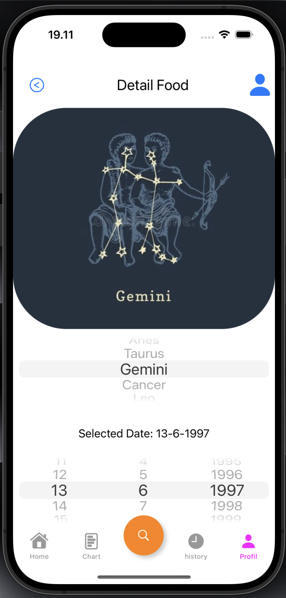

# Order Pasta Food App

This is an application that aims to order food in the form of pasta that can be ordered through the application.

## Table of Contents
- [Features](#features)
- [Installation](#installation)
- [Tech Stack](#tech-stack)
- [ScreenShots](#ScreenShots)

## Features
- *Login*: Login to the App.
- *Register*:  Register Account to Login the App.
- *Logout*: Logout from the App.
- *Add Order*: Add new Order with details like name, category, price, and date.
- *Remove Order*: Remove Order from Chart.
- *Change Image*: Change Avatar Image.
- *Change BirthDate*:  Change the Birthday date.
- *Voucher*: Can use the voucher for purchasing order.
- *History Order*: Can see for History Order.

## Installation

1. *Clone the repository*
   sh
   git clone https://github.com/irvanwilly13/Assignment2_MuhammadIrvanWilly

2. *Open the project*
   Open the cloned repository in Xcode.

## Tech Stack

- *Language*: Swift
- *IDE*: Xcode
- *Framework*: Cocoa (for macOS development)

## ScreenShots

## Screenshots

